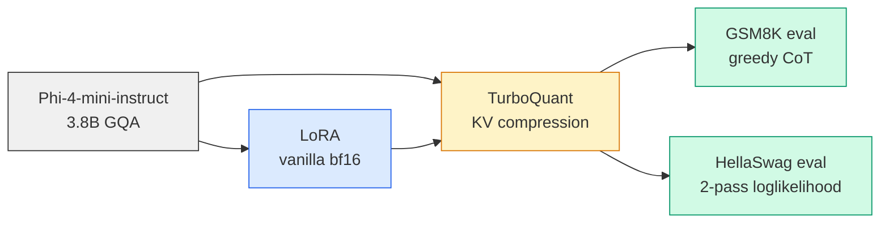

# Efficient LLM Pipeline

[](https://github.com/YanissAmz/efficient-llm-pipeline/actions)


End-to-end implementation and honest evaluation of **TurboQuant KV cache compression** ([arXiv:2504.19874](https://arxiv.org/abs/2504.19874)) on `microsoft/Phi-4-mini-instruct` (3.8B), with vanilla LoRA fine-tuning, two complementary benchmarks (GSM8K + HellaSwag), and a clean integration into the modern HuggingFace `Cache` API. Single RTX 3090 (24 GB).

> **TL;DR.** TurboQuant 4-bit gives a **4× KV cache compression for ~10pts on hard reasoning and ~2pts on commonsense**. TurboQuant 3-bit (5.33×) **survives commonsense but collapses on multi-step arithmetic**. Naïve LoRA fine-tuning of an already-strong instruct model **degrades** GSM8K by 14pts — a finding worth understanding before reaching for fine-tuning as a default.

---

## Headline results

> 50 GSM8K test samples + 50 HellaSwag validation samples, RTX 3090, bf16, greedy decoding (GSM8K) / length-normalized loglikelihood (HellaSwag), seed=42. Raw JSON outputs in `results/`.

### Per-model comparison (50 samples)

| Model | Config | KV bits | Compression | **GSM8K** | **HellaSwag** |
|---|---|---|---|---|---|
| `Phi-4-mini-instruct` (3.8B, 8 KV heads, 32 layers) | fp16 baseline | 16 | 1.00× | **90.0%** | **62.0%** |
|  | TurboQuant 4-bit | 4 | 4.00× | **80.0%** ▼10 | 60.0% ▼2 |
|  | TurboQuant 3-bit | 3 | 5.33× | 0.0% ▼90 *collapse* | **52.0%** ▼10 |
| `Qwen2.5-3B-Instruct` (3B, **2 KV heads**, **36 layers**) | fp16 baseline | 16 | 1.00× | **70.0%** | — |
|  | TurboQuant 4-bit | 4 | 4.00× | **0.0% ⚠ collapse** | — |
|  | TurboQuant 3-bit | 3 | 5.33× | 0.0% ▼70 | — |

### LoRA fine-tuning (Phi-4-mini, 50 samples)

| Configuration | GSM8K | Δ vs fp16 base | Avg new tokens |
|---|---|---|---|
| fp16 base | 90.0% | — | 192 |
| fp16 + LoRA-v1 *(lr=2e-4, 1ep)* | 76.0% | –14 | 99 |
| fp16 + LoRA-v2 *(lr=5e-5, 0.5ep)* | 76.0% | –14 | 103 |
| TQ 4-bit + LoRA-v2 | 60.0% | –30 | 117 |

---

**Four findings the table makes visible :**

1. **TurboQuant 4-bit is a viable operating point on the right architecture.** On Phi-4-mini, 4× KV cache compression for a –2 to –10 accuracy point cost depending on task difficulty.
2. **The break point of TurboQuant is task-dependent, not bit-budget-dependent.** On Phi-4-mini, TurboQuant 3-bit collapses on GSM8K because multi-step arithmetic requires preserving exact key/value alignment over many decoded tokens — but the same compression survives HellaSwag with manageable degradation.
3. **TurboQuant is *also* architecture-dependent, and the per-vector reconstruction metric lies about it.** Reconstruction quality on real K/V at 4 bits is identical on Phi-4-mini and Qwen2.5-3B (`cos_sim ≈ 0.97`). And yet TurboQuant 4-bit collapses on Qwen2.5-3B (0% vs 70% base). Three architectural properties explain the gap : (a) Qwen2.5-3B has **2 KV heads shared across 16 Q heads** vs Phi's **8 KV heads across 24 Q heads**, so each reconstruction error is amplified by 8×/3× ≈ 2.7×; (b) Qwen has **36 layers vs 32**, so errors compound through more steps; (c) early-layer activations are more extreme on Qwen (`k.abs.max ≈ 92` vs `17` on Phi), so the Lloyd-Max codebook — trained on a `N(0,1)` distribution — sees values deeper into its tails. **Per-vector L2 is a necessary but not sufficient metric for a KV cache quantizer.**
4. **Naïve LoRA fine-tuning of a strong instruct model can hurt.** Two LoRA regimes on Phi-4-mini (lr=2e-4 / 1ep and lr=5e-5 / 0.5ep) both land at exactly the same 76% on GSM8K (–14pts vs base), with much shorter outputs (99 tokens vs 192). The model learns the *surface format* of GSM8K answers (`<<X*Y=Z>>` calculator annotations + `#### N` ending) but loses some plain-English reasoning robustness. Documented honestly rather than hyperparameter-tuned toward a positive headline.

---

## Pipeline



| Stage | Script | What it does |
|---|---|---|
| **Smoke** | `scripts/smoke_integration.py` | Proves `model.generate(past_key_values=TurboQuantCache(...))` produces coherent text |
| **Reconstruction diag** | `scripts/diag_quantize_real_kv.py` | Measures `rel_l2 / cos_sim` of TurboQuant on real LLM K/V at bits 2/3/4 |
| **Train** | `scripts/train.py` | Vanilla bf16 LoRA on GSM8K train, no Unsloth, no bnb |
| **Eval (generation)** | `scripts/eval.py` | GSM8K, optional `--lora-path` and `--turboquant --bits N` flags |
| **Eval (loglikelihood)** | `scripts/eval_hellaswag.py` | HellaSwag, 2-pass forward to exercise the cache |
| **Aggregate** | `scripts/aggregate_eval.py` | Build a Markdown comparison from any number of eval JSONs |

---

## TurboQuant — how it works

TurboQuant (Google Research, 2025) is a **provably unbiased** vector quantization scheme for KV cache compression. It combines two ideas :

1. **PolarQuant (MSE-optimal).** Apply a fixed random orthogonal rotation to each vector, then per-coordinate Lloyd-Max scalar quantization. The rotation makes the post-rotation distribution closer to N(0, ‖x‖²/d), so a *single* codebook trained for N(0,1) works for all vectors after per-vector norm rescaling.
2. **QJL residual correction (1-bit unbiased).** The residual `r = x − x_mse` is projected by a Johnson-Lindenstrauss matrix and reduced to its sign bits. The reconstruction `(√(π/2)/d) · ‖r‖ · sign(rS) · S` is an *unbiased* estimator of `r`, restoring `E[<q, x̂>] = <q, x>` for any query `q`.

```
x  ──►  ‖x‖, x/‖x‖   ──►  Π·u    ──►  argmin_k |c_k − ŷ_j·√d|   ──►  idx
                          rotation       Lloyd-Max codebook
                                                                       │
                          r = x − x_mse  ──►  sign(r·Sᵀ)  ──►   qjl_bits, ‖r‖
                                                                       │
storage tuple per vector :  (idx, qjl_bits, ‖r‖, ‖x‖)                  ◄
```

A 4-bit `TurboQuantCache(dim=128)` with `bits=4` stores 4 indices/QJL-bits per coordinate plus 2 fp32 norms per vector — about **4× smaller** than the fp16 KV in the limit of long contexts.

### Two bugs the rebuild fixed

This implementation went through a clean rebuild after a previous attempt was blocked on integration. Two non-obvious bugs were found and fixed during the rebuild :

1. **`DynamicCache` API change in `transformers ≥ 5.4`.** The cache's per-layer state moved from `self.key_cache: list[Tensor]` to `self.layers: list[DynamicLayer]`. Subclasses that wrote to the old `key_cache` attribute would silently produce garbage : `get_seq_length()` returned 0 and the model masked the cache out. The fix is `TurboQuantLayer(DynamicLayer)` + `partial(TurboQuantLayer, quantizer=...)` factory wiring — see `src/turboquant/polar_quant.py`.
2. **`TurboQuantMSE` assumed unit-norm inputs.** The fixed `scale = 1/√d` is only correct if `‖x‖ = 1`. Real LLM K/V have `std ≈ 2.7`, so the codebook clipped everything to its extreme values (`rel_l2 > 1` on real data — reconstruction was further from the input than zero). The fix is per-vector norm rescaling, with `‖x‖` stored alongside the indices. **Reconstruction quality on real Phi-4-mini K/V at 4 bits went from `cos_sim = 0.66` to `0.98`.**

The unit tests (25 tests on synthetic N(0,1) data) all passed before the fix because `test_compression_reduces_error` only checked `errors[4] < errors[2]` — a monotone relation that holds even when *every* bit budget produces useless reconstructions. Two new anti-regression tests now check absolute reconstruction quality at realistic dimensions and inner-product unbiasedness :

```python
tests/test_turboquant.py::TestTurboQuantMSE::test_reconstruction_quality_high_dim
tests/test_turboquant.py::TestTurboQuantProd::test_unbiased_inner_product
```

**Lesson :** quantization unit tests must measure absolute quality at realistic dimensions, not just relative monotonicity.

---

## Reproducing the results

```bash
git clone https://github.com/YanissAmz/efficient-llm-pipeline.git
cd efficient-llm-pipeline

uv venv && source .venv/bin/activate
uv pip install -e ".[dev]"

# 27/27 unit tests, including the two new anti-regression tests
pytest tests/

# Smoke: prove TurboQuantCache works end-to-end
PYTHONPATH=. python scripts/smoke_integration.py

# GSM8K eval matrix (50 samples each, ~3 min on 3090)
PYTHONPATH=. python scripts/eval.py --samples 50
PYTHONPATH=. python scripts/eval.py --samples 50 --turboquant --bits 4
PYTHONPATH=. python scripts/eval.py --samples 50 --turboquant --bits 3

# Optional: vanilla LoRA training (~17 min on 3090, full GSM8K train, 1 epoch)
PYTHONPATH=. python scripts/train.py --output-dir checkpoints/phi4mini-gsm8k-lora

# Eval the trained LoRA against TurboQuant
PYTHONPATH=. python scripts/eval.py --samples 50 \
    --lora-path checkpoints/phi4mini-gsm8k-lora --turboquant --bits 4

# HellaSwag matrix (50 samples each, ~30s for base, ~1 min for TQ)
PYTHONPATH=. python scripts/eval_hellaswag.py --samples 50 --length-norm
PYTHONPATH=. python scripts/eval_hellaswag.py --samples 50 --length-norm --turboquant --bits 4
PYTHONPATH=. python scripts/eval_hellaswag.py --samples 50 --length-norm --turboquant --bits 3

# Aggregate everything into a single comparison table
PYTHONPATH=. python scripts/aggregate_eval.py results/eval_phi4mini_*_n50.json
```

All raw JSON results are in `results/`. The full Markdown comparison is `results/comparison.md`.

---

## Project structure

```
src/
  turboquant/
    polar_quant.py    PolarQuant + QJL + TurboQuantLayer (DynamicLayer subclass)
    qjl.py            Standalone 1-bit unbiased QJL quantizer
  evaluate/
    metrics.py        GSM8K answer extraction, exact-match, batch metrics
scripts/
  smoke_integration.py     Step 1 — prove TQ cache works in model.generate
  diag_quantize_real_kv.py Reconstruction-quality diagnostic on real K/V
  train.py                 Step 3 — vanilla LoRA bf16 training
  eval.py                  Step 2 — GSM8K eval, supports --lora-path and --turboquant
  eval_hellaswag.py        Step 4 — HellaSwag loglikelihood with 2-pass forward
  aggregate_eval.py        Markdown comparison-table builder
tests/                     27 unit tests (PolarQuant + QJL + GSM8K metrics)
configs/default.yaml       Training/eval/serving config
docs/rebuild-plan.md       Integration-first rebuild plan (source of truth)
results/                   Raw eval JSON + comparison Markdown
```

---

## Tech stack

| | |
|---|---|
| **Primary model** | `microsoft/Phi-4-mini-instruct` (3.8B, 32 layers, 24 Q heads, **8 KV heads**, head_dim=128) |
| **Cross-arch model** | `Qwen/Qwen2.5-3B-Instruct` (3B, 36 layers, 16 Q heads, **2 KV heads**, head_dim=128) |
| **Fine-tuning** | `peft` LoRA (r=16, α=32, target q/k/v/o_proj), vanilla `transformers.Trainer`, bf16 |
| **Compression** | TurboQuant (PolarQuant + QJL), `transformers ≥ 5.4` `Cache` API |
| **Eval** | GSM8K (greedy CoT, exact match) + HellaSwag (2-pass loglikelihood) |
| **Serving** | FastAPI + Uvicorn (`src/serve/api.py`) — env-driven, optional LoRA + TurboQuant |
| **GPU** | NVIDIA RTX 3090 24 GB |
| **Stack** | `transformers 5.4`, `peft 0.18`, `torch 2.10+cu128`, `datasets 4.3` |
| **CI** | GitHub Actions (`ruff` + `pytest`, runs on all branches) |

No Unsloth, no bnb 4-bit. The rebuild deliberately uses the most boring vanilla path so that the *only* nontrivial component is TurboQuant itself.

---

## Serving

```bash
MODEL_NAME=microsoft/Phi-4-mini-instruct \
USE_TURBOQUANT=true \
TURBOQUANT_BITS=4 \
uvicorn src.serve.api:app --host 0.0.0.0 --port 8000

# Solve a math problem
curl -s http://localhost:8000/solve -H 'Content-Type: application/json' \
  -d '{"question": "If a train travels 120 km in 2 hours, what is its average speed in km/h?"}' \
  | jq '.'
```

Endpoints: `GET /health`, `GET /info`, `POST /solve`. The `solve` endpoint accepts a per-request `use_turboquant` and `bits` override so you can A/B test a single model instance on the fly. Optional LoRA adapter loading via `LORA_PATH=...`.

---

## Limitations & honest caveats

- **Sample count.** The headline table is 50 samples per config. Full GSM8K test (1.3k samples) and HellaSwag validation (10k) would move these by ±3-5pts; the qualitative ranking (Phi-4-mini tolerates TQ4, Qwen2.5-3B collapses at TQ4, GSM8K breaks before HellaSwag) is robust.
- **Architecture coverage.** Two models is enough to *falsify* the naïve "TurboQuant works everywhere" narrative (it doesn't work on Qwen2.5-3B at 4 bits), but not enough to *quantify* the boundary. A broader sweep over KV head count / depth / outlier profile is a natural next step.
- **Latency overhead.** TurboQuant adds ~2× wall-clock latency in this implementation because the quantize/dequantize roundtrip happens in plain PyTorch (no kernel fusion). Fixable with a CUDA kernel.
- **VRAM is unchanged in memory.** This implementation stores *both* the compressed indices and the dequantized K/V (the latter is what attention reads). The compression ratio is *theoretical* — a real win requires dequantizing on the fly inside the attention kernel.
- **No Unsloth.** Step 0 of the rebuild deliberately removed Unsloth because its compiled cache hijacks the attention forward and made TurboQuant impossible to integrate. Adding it back as a *speed* optimization on top of a proven baseline is on the roadmap.

---

## Roadmap

- [ ] Custom CUDA kernel for fused dequant + attention → real VRAM and latency wins
- [ ] Broader cross-arch sweep (Llama-3.2-3B, Mistral-7B, Gemma-2-2B) to map the "TurboQuant works vs collapses" boundary as a function of `num_kv_heads`, `num_hidden_layers`, and early-layer activation outliers
- [ ] Outlier-aware variant : learned per-layer calibration on top of the random rotation to handle models like Qwen2.5-3B that have early-layer `abs.max > 90`
- [ ] Larger sample counts (full GSM8K test, full HellaSwag validation) for tighter error bars
- [x] CI integration test (`tests/test_turboquant_integration.py`)
- [x] FastAPI `serve` endpoint with optional LoRA + TurboQuant

---

## License

MIT
