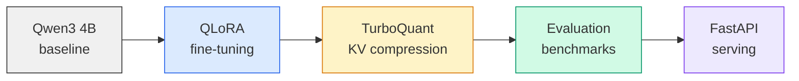

# Efficient LLM Pipeline

[](https://github.com/YanissAmz/efficient-llm-pipeline/actions)


End-to-end LLM optimization pipeline: **QLoRA fine-tuning** on GSM8K, **TurboQuant KV cache compression** (5.3x), rigorous evaluation, and **FastAPI serving** --- all running on a single RTX 3090 (24 GB).

> TurboQuant implements PolarQuant + QJL from [arXiv:2504.19874](https://arxiv.org/abs/2504.19874) for unbiased KV cache compression with provable inner-product guarantees.

---

## Pipeline



| Stage | What | Key metric |
|---|---|---|
| **Baseline** | Measure Qwen3-4B zero-shot on GSM8K | Accuracy, latency, VRAM |
| **Fine-tuning** | QLoRA (r=16, alpha=32) on GSM8K train set | Accuracy gain |
| **Compression** | TurboQuant 3-bit KV cache (PolarQuant + QJL) | 5.3x compression, VRAM saved |
| **Evaluation** | Exact-match accuracy, latency, throughput, VRAM | Before/after comparison |
| **Serving** | FastAPI with /solve, /health, /info endpoints | Tokens/s, latency p99 |

---

## Quick start

```bash
git clone https://github.com/YanissAmz/efficient-llm-pipeline.git
cd efficient-llm-pipeline

# Install
uv venv && source .venv/bin/activate
uv pip install -e ".[dev]"

# Run tests
make test

# Start API server
make serve
```

---

## Project structure

```
src/
  turboquant/         PolarQuant + QJL KV cache compression
  evaluate/           Accuracy metrics & benchmark utilities
  serve/              FastAPI application
configs/              YAML training/eval/serving configs
scripts/              CLI entrypoints (train, eval, benchmark, serve)
tests/                Unit & integration tests
notebooks/            Reference notebooks (Colab originals)
results/              Benchmark outputs & comparison tables
```

---

## TurboQuant --- KV cache compression

Implementation of the TurboQuant method from Google Research, combining:

- **PolarQuant (MSE-optimal)**: random orthogonal rotation + Lloyd-Max codebook quantization
- **QJL (1-bit unbiased)**: Johnson-Lindenstrauss sign projection for residual correction

**Key property**: the compressed KV cache produces **unbiased** attention scores --- `E[<q, k_hat>] = <q, k>` for any query vector.

```
Original KV (fp16) --> PolarQuant (b-1 bits) --> QJL correction (1 bit) --> 5.3x smaller
                       rotation + codebook        sign(S * residual)        unbiased
```

---

## Results

> Benchmarks on RTX 3090 24 GB. Full results in `results/`.

| | Baseline | + QLoRA | + TurboQuant 3-bit |
|---|---|---|---|
| **GSM8K accuracy** | -- | -- | -- |
| **Avg latency (s)** | -- | -- | -- |
| **VRAM peak (GB)** | -- | -- | -- |
| **KV cache compression** | 1x | 1x | 5.3x |

*Results will be filled after running the full pipeline on RTX 3090.*

---

## API

```bash
# Health check
curl http://localhost:8000/health

# Solve a math problem
curl -X POST http://localhost:8000/solve \
  -H "Content-Type: application/json" \
  -d '{"question": "If a train travels 120 km in 2 hours, what is its speed in km/h?"}'
```

**Endpoints:**
| Method | Path | Description |
|---|---|---|
| `GET` | `/health` | API & model status, VRAM usage |
| `GET` | `/info` | Model config & compression settings |
| `POST` | `/solve` | Solve a math problem with chain-of-thought |

---

## Tech stack

| | |
|---|---|
| **Model** | Qwen3-4B (Alibaba) |
| **Fine-tuning** | QLoRA via PEFT + bitsandbytes |
| **Compression** | TurboQuant (PolarQuant + QJL) |
| **Evaluation** | Custom exact-match + benchmark suite |
| **Serving** | FastAPI + Uvicorn |
| **GPU** | NVIDIA RTX 3090 24 GB |
| **CI** | GitHub Actions (ruff + pytest) |

---

## Limitations & future work

- Compression evaluated on GSM8K only --- generalization to other tasks not yet tested
- TurboQuant requires head_dim-sized random matrices stored in memory
- No batched inference yet (single request serving)
- Planned: GPTQ/AWQ/GGUF comparison, Streamlit demo, multi-GPU support

---

## License

MIT
